# PARCIAL 02 AREP

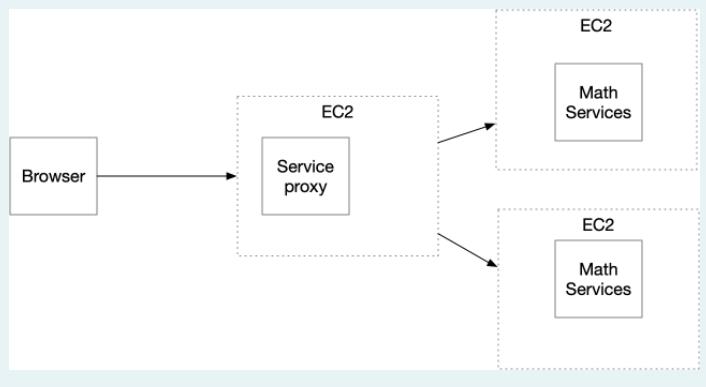

# Desarrollo

Se crean dos proyectos: Uno para el Servidor Proxy y otro para el servicio Math que nos permitirá obtener los servicios de Coseno y Exponencial deun número (Euler elevado al número).

Ambos servicios se contruyeron mediante Spark. El servicio Proxy varia en sus llamados a las 2 instancias que se tienen de Math Services empleando el algoritmo de RoundRobin. 

Luego de realizar las aplicaciones de Calculadora y el balanceador de carga, se debe instanciar dos maquinas EC2 y subir en ambas los archivos correspondientes:

1. Descargar el par de llaves donde realizaremos la conexión.

2. Subir los archivos con sftp y el comando put:

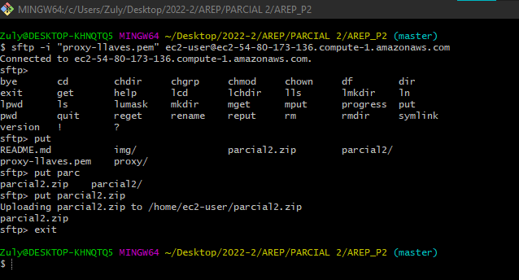

3. Se descomprime el archivo con unzip y se ejecuta con el comando:

    java -cp "target/classes:target/dependency/*" edu.escuelaing.arem.SparkWebApp

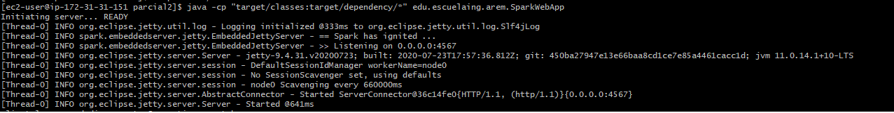

4. Al ingresar nos muestra el resultado esperado para coseno de 0:

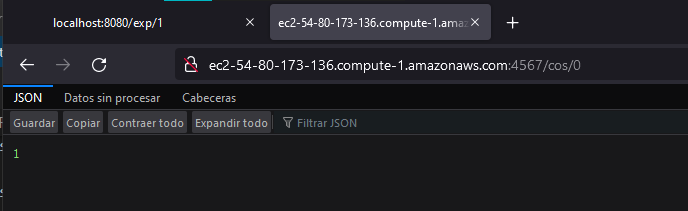

5. Repetimos el mismo proceso para la app anterior para tener una segunda instancia de la calculadora. No olvidar configurar reglas de entrada:

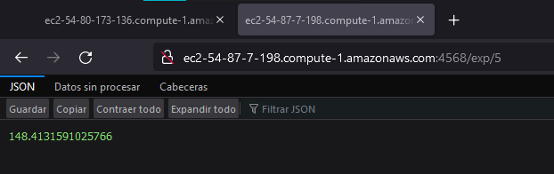

Prueba con el proxy local:

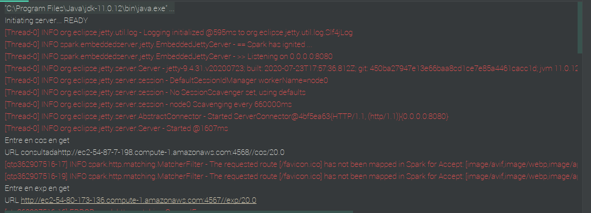

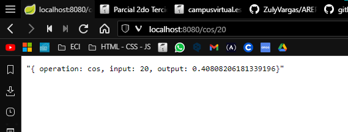

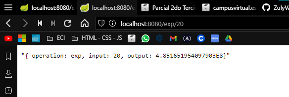

Se realiza una tercer instancia para el PROXY en un EC2 siguiendo los mismos pasos:

1. Crear y descargar las llaves.
2. Configurar reglas de seguridad (Puertos).
3. Comprimir el archivo, usar sftp y el comando put para enviar.
4. Installar JVM, ejecutar el servidor Proxy y conectarse:

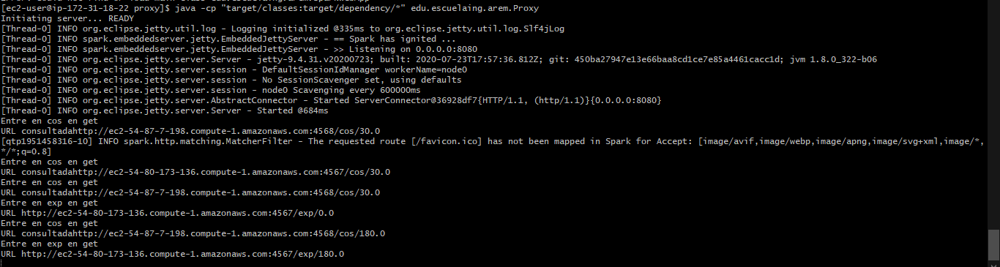

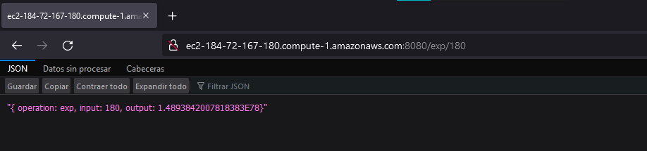
Instancias:

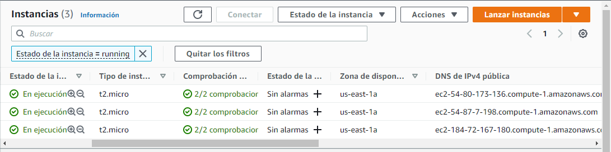

## Correr en EC2:

Para correr en EC2 debemos verificar que se hayan cargado las dependencias. 
Para ejecutar la calculadora se usa:

     java -cp "target/classes:target/dependency/*" edu.escuelaing.arem.SparkWebApp

Para ejecutar el Proxy:

     java -cp "target/classes:target/dependency/*" edu.escuelaing.arem.Proxy

## Autores

**Zuly Valentina Vargas Ramírez**

## Licencia

Este proyecto esta bajo la licencia GNU(General Public License) los detalles se encuentran en el archivo [LICENSE](LICENSE.txt).
